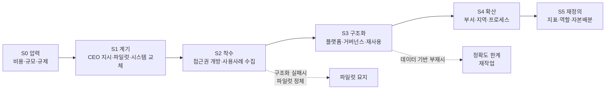
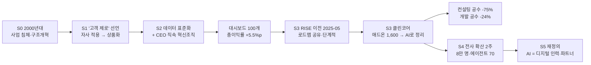
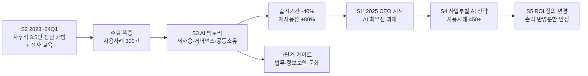
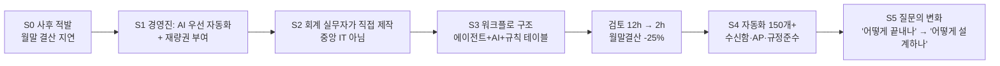
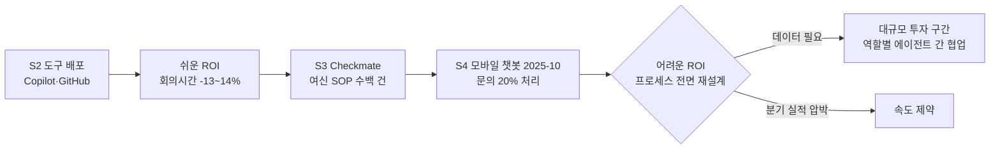
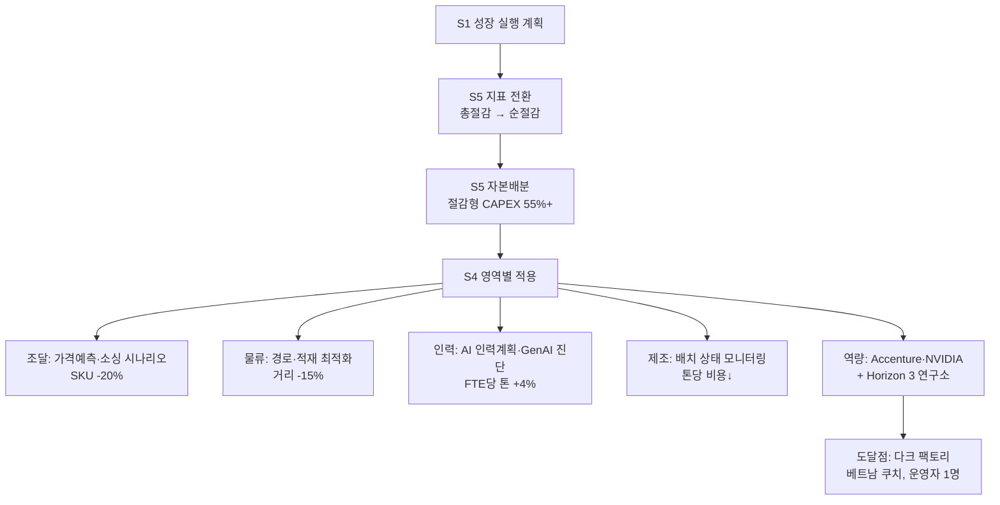
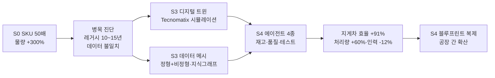
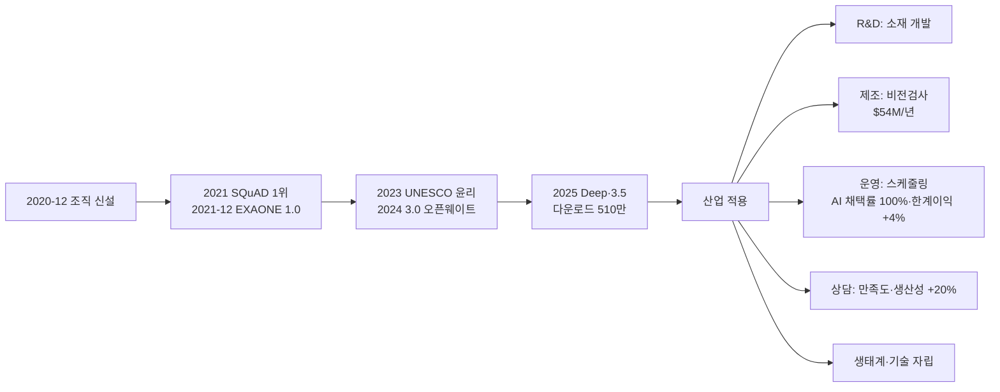

# AX 전환 흐름 분석 (Case Flows) — 기업은 어떤 순서로 AX화되었나

> 대상 프레임워크: Holmström & Magnusson (2026), *The AI transformation framework* — 자동화 · 증강 · 데이터 풍부성 3축 큐브,
> path framing / narrating / stretching 3단계.
> 자료: 본 저장소 수집 코퍼스(유튜브 자막 전문). 점수는 `analysis/aitf_scored.csv`, 사례 원문 정리는 `docs/AITF_CASE_DOSSIER.md`.

`AITF_CASES.md`가 자동 산출 목록, `AITF_CASE_DOSSIER.md`가 사례별 정지 화면이라면, **이 문서는 시간축**이다.
"무엇을 갖췄나"가 아니라 **"무엇 때문에 시작해서, 어떤 순서로, 무엇에 막혀, 어디까지 갔나"**를 사례별로 복원하고
교차 비교한다. 사례연구(case study) 원고의 4장(사례 기술)과 5장(교차 사례 분석)에 그대로 대응하도록 구성했다.

---

## 0. 분석 설계

### 0-1. 분석 단위와 사례 선택
- **분석 단위**: 조직(기업) 1곳의 **AX 전환 궤적**. 관찰 창은 자료가 허용하는 범위(대개 2020~2026).
- **사례 선택**: 확률표집이 아니라 **이론적 표집(theoretical sampling)**. 세 축의 서로 다른 조합과
  서로 다른 계기(비용압박 · CEO 지시 · 규모 폭증 · 규제)를 대표하도록 8개 주사례 + 4개 보조사례를 골랐다.
- **선택 기준**: ① 시점·순서를 알 수 있는 서술이 있을 것 ② 조치와 결과가 함께 진술될 것
  ③ 세 축 중 최소 2축이 등장할 것. (이 기준에 못 미치는 사례는 §4의 보조사례로만 다룬다.)

### 0-2. 근거 등급 (모든 flow 항목에 표기)
| 등급 | 정의 | 신뢰 수준 |
|---|---|---|
| **A** | 도입 조직 임원·실무자가 직접 진술 + 시점 또는 수치 명시 | 높음 (투자자 발표는 공시 규율이 걸려 A+) |
| **B** | 벤더 채널에 도입기업이 출연하거나, 벤더가 고객 사례를 요약 | 중간 (선택 편향·홍보 목적) |
| **C** | 미디어·학계·컨설팅의 제3자 요약 | 낮음 (원출처 미상인 수치 다수) |
| **[추론]** | 원문에 명시되지 않았고 서술 순서로부터 필자가 재구성한 부분 | 검증 대상 |

🔴 **큐브 좌표의 시점 변화(t0 → t1)는 전부 [추론]이다.** 코퍼스는 특정 시점의 발화만 담고 있어 종단 측정이 불가능하다.
좌표 이동은 "발화 안에서 조직이 스스로 서술한 이전 상태 → 현재 상태"를 옮긴 것이며, 검증은 인터뷰·공시로 해야 한다.

### 0-3. 공통 코딩 틀 — 전환 흐름 6단계
사례들을 읽고 귀납적으로 뽑은 뒤 논문의 3단계와 대응시킨 것이다.

| 단계 | 이름 | 무엇이 일어나는가 | 논문 대응 |
|---|---|---|---|
| S0 | **압력(Pressure)** | 비용·규모·규제·경쟁에서 오는 외생 압박. 아직 AI 이야기가 아님 | — (전사(前史)) |
| S1 | **계기(Trigger)** | 특정 사건이 AI를 의제로 올림 (CEO 지시, 파일럿 성공, 시스템 교체 시점) | path framing 진입 |
| S2 | **착수(Seeding)** | 접근권 개방·도구 배포·초기 사용사례 수집. 수요가 폭증하며 통제 문제 발생 | path framing |
| S3 | **구조화(Structuring)** | 플랫폼·거버넌스·재사용 체계로 수요를 정리. **대부분의 사례가 여기서 갈린다** | path narrating |
| S4 | **확산(Scaling)** | 부서·지역·프로세스로 범위 확대. Scope 항목이 올라가는 구간 | path stretching |
| S5 | **재정의(Redefining)** | 지표·역할·자본배분이 바뀜. "분모가 바뀌는" 구간 | 프레임워크 밖(본 연구 기여점) |

---

# 1. 주사례 8건 — 기업별 전환 흐름

## 사례 A. NEC — 데이터 기반을 먼저 깔고 그 위에 AI를 얹은 경로

**한 줄 궤적**: 경영위기 구조조정(2000년대) → '고객 제로' 선언 → 데이터 표준화·대시보드 → RISE 이전 →
클린코어를 AI로 처리 → 전사 AI 상시 사용.

| 시점 | 사건·계기 | 조치 | 주체 | 산출물 | 결과 | 근거 |
|---|---|---|---|---|---|---|
| 2000년대 | 사업 침체 | 구조·문화 개혁 | 경영진 | — | 성장 회복 서사 | A |
| (연도 미상) | 개혁의 연장 | **'고객 제로' 기업혁신 이니셔티브** 선언 — 자사 적용 경험을 상품화 | 전사 | 이니셔티브 | — | A |
| (RISE 이전) | 데이터 기반 경영 착수 | 핵심 시스템 클라우드 이전 + **프로세스 데이터 표준화** / **CEO 직속 전사 혁신 조직** 신설 | CEO 직속 조직 | **경영 대시보드 약 100개** | **총이익률 5.5%p 향상** | A |
| 2025-05 | 핵심 시스템 현대화 시점 도래 | **RISE with SAP 가동** — 일상 운영·타 IT 프로젝트와 병행, SAP와 로드맵 공유·단계적 진행 | IT + SAP | 현대화된 ERP | 안정 가동 | A |
| 진행 중 | 애드온 1,600개가 업데이트마다 공수 유발 | **클린코어**: 애드온 1,600개를 실시간 시각화 → 불필요 제거, 분석·설계·개발·테스트에 AI 내장 | IT | 시각화 대시보드 | **조사 단계 컨설팅 공수 75%↓** | A |
| 2025 | 위 연장 | AI 에이전트로 **클린코어 구성요소 48개 개발** | IT | 구성요소 | **개발 공수 24%↓** | A |
| 진행 중 | 주변 시스템 이질성 | BlackLine·Concur 등 **약 200개 주변 시스템** 클라우드 네이티브 전환 | IT | — | — | A |
| 진행 중 | 전사 확산 | **2주 만에** 전 직원 안전 사용 환경 구축, 자체 기술(cotomi)로 보강 | CEO·CIO 주도 + 상향식 | 사내 AI 플랫폼 | **8만 명 상시 사용 · 에이전트 70개 · 특수모델 1,400개 · 21만 시간 절감** | A |
| 목표 | — | 백오피스 SAP AI 에이전트 통합, 에이전트 마이닝 | — | — | **생산성 3배 목표 / 2027년 100% 클린코어·개발공수 50%↓** | A |

- **큐브 궤적 [추론]**: `L-L-L` → (데이터 표준화·대시보드) `L-L-H` → (클린코어·에이전트) **`H-L-H`**(측정값).
  증강 축은 시종 0 — 사람의 판단을 강화한다는 언어가 없다.
- **이 사례가 보여주는 것**: 논문의 "데이터 풍부성 선행" 명제를 조직 언어로 그대로 실행한 경로. 특히
  **데이터 표준화의 성과(총이익률)를 AI 이전 단계에서 이미 회수**했다는 점이 중요하다.
- **아직 모르는 것(인터뷰 질문)**: 21만 시간 절감이 인건비로 어떻게 처리됐는가(재배치/감축/증량)?
  '고객 제로' 경험의 상품화가 매출에 실제로 얼마나 기여했는가? → INTERVIEW_GUIDE C1(비용구조)·C3(노동).

---

## 사례 B. Philip Morris International — 접근권 개방이 수요 폭증을 낳고, 플랫폼으로 수습한 경로

**한 줄 궤적**: 전 사무직 개방(신뢰 구축) → 사용사례 300건 폭증 → 'AI 팩토리' 운영모델로 구조화 →
CEO의 전사 최우선 과제 지정 → 450개 사용사례·거버넌스 게이트 정착.

| 시점 | 사건·계기 | 조치 | 주체 | 산출물 | 결과 | 근거 |
|---|---|---|---|---|---|---|
| 2023 ~ 2024 Q1 | 생성형 AI 확산, 조직 내 불안 | **사무직 약 35,000명 전원에게 Copilot 등 접근권 부여**(2024 Q1 초 달성) + 전사 교육(주간 라이브 세션·자기주도 학습·AI 리터러시 캠페인·경영진 참여) | IT + HR | 접근권·교육 프로그램 | 신뢰·준비도 확보 | A |
| 2024 Q2~Q3 | **사용사례 약 300건이 전사에서 동시 제기** — 감당·우선순위 문제 | 사용사례를 **주제·복잡성으로 평가**하고 **반복 가능한 엔터프라이즈 기능으로 그룹화** | 기술혁신팀 | 사용사례 포트폴리오 | 중복 개발 억제 | A |
| 2024 Q3~ | 파편화(스택 상이·거버넌스 불일치·부서 고립) | **'AI 팩토리' 구축** — 분산 개발 → 핵심팀이 지원하는 재사용 기능 플랫폼. 기둥: 거버넌스·재사용성·비즈니스 공동소유 | AI 팩토리 PMO | 재사용 마이크로서비스 | **출시기간 40%↓ · 재사용성 80%↑** | A |
| 2025 초 | 초기 성과가 CEO를 움직임 | **CEO가 AI를 전사 최우선 과제로 지시** → "전술적 자동화 대신 프로세스 재설계" 방침 | CEO | 전사 지시 | 사업부별 AI 전략·목표 수립 | A |
| 상시 | 규제·법무 리스크 | **7단계 거버넌스 게이트**(법무·정보보안·비즈니스·문화 검토), 제로 트러스트 내장, 조기 협의 | PMO | 게이트 프로세스 | 검증·배포 가속, 기준 미달 벤더 조기 차단 | A |
| 상시 | ROI 논쟁 | **"손익에 측정 가능한 영향이 없으면 ROI로 인정하지 않는다"**, 재무팀과 가정 검증·사후 실현가치 추적 | PMO + 재무 | ROI 규칙 | 통화 요약·감사 정확도·상담원 교육 정량화 | A |
| 2025-03 | 에이전트 기술 등장 | OpenAI 에이전트 SDK 공개 **이전에** 내부 PoC 착수 | 기술혁신팀 | PoC | — | A |
| 현재 | — | 팀 2명(2023) → 다기능 팀, **사용사례 450건+**, AI 챔피언 네트워크 | 전사 | — | **수천 시간 절감·수천만 달러 잠재수익** | A |

- **큐브 궤적 [추론]**: `L-L-L` → (전원 개방) `L-H-L` → (팩토리·프로세스 재설계) **`H-H-L`**(측정값). 데이터 축은 계속 낮다 —
  발화자도 "필요한 건 견고한 데이터 파이프라인"이라고 말할 뿐 자사 데이터 기반은 서술하지 않는다.
- **🔴 이 사례의 이론적 가치**: **S2(착수) → S3(구조화)의 전환이 실패 분기점**임을 보여주는 유일한 상세 자료.
  "300건 → 그룹화 → 플랫폼"이라는 수습 과정이 시점과 함께 남아 있다. 또한 **CEO 지시가 원인이 아니라 결과**로 배치된다
  (초기 성과 → CEO 지시). 대부분의 규범적 문헌이 가정하는 순서(톱다운 지시 → 도입)와 반대다.
- **아직 모르는 것**: 300건 중 몇 건이 살아남았나(450건은 누적인가 활성인가)? 사무직 3.5만 명 개방의 실제 사용률은?
  → C4(도입 성패)·C6(측정).

---

## 사례 C. Zapier 회계팀 — 현업이 직접 만든 상향식 경로

**한 줄 궤적**: 사후 적발의 반복 → 경영진이 재량권 부여 → 회계팀이 직접 워크플로 제작 → 시스템화(150개+) →
질문 자체가 "어떻게 끝내나"에서 "어떻게 설계하나"로 변함.

| 시점 | 사건·계기 | 조치 | 주체 | 산출물 | 결과 | 근거 |
|---|---|---|---|---|---|---|
| 이전 | 전표 코딩 오류를 **사후 검토에서 발견** → 재오픈·수정·재분석, 월말 결산 지연. Slack·이메일로 산발 대응 | — | 회계팀 | — | 반응적 운영 | A |
| 전환점 | 경영진 차원에서 **AI 우선 자동화**를 최우선 과제로 설정 | 팀에 **"공장을 재설계할 공간과 권한, 그리고 기대"** 부여 | CFO·경영진 | 재량권 | — | A |
| 구축 | 🔴 **중앙 IT팀도 엔지니어 집단도 아닌, 회계 실무자들이 직접 제작** | NetSuite 전표 실시간 모니터링 워크플로: 승인·당기 전표 필터 → **에이전트 단계**(작성자·승인자 Slack ID 추론 조회) → **AI 단계**(프로젝트 기본값·계좌번호 추출·형식 통일) → **Zapier Tables 규칙 조회** → 예외 3경로 분기(부서 불일치/부서 누락/프로젝트 누락) → Slack 알림 + 규정준수 기록 | 회계 관리자 | 워크플로 | **검토 12시간 → 2시간 미만** | A |
| 확장 | 같은 방식의 반복 | AP: Zip+NetSuite로 상환 일정 자동 부여. 선정 기준 = **반복적·규칙 기반·저위험** | AP 담당 | 워크플로 | — | A |
| 현재 | — | **자동화·에이전트 150개+**(수신함·월말결산·매입채무·규정준수), 도구 종속 없음(Claude·ChatGPT·Cursor 혼용) | 회계팀 8명 | "하나의 시스템" | **월말 결산 25%↓, 전표 오류 상시 자동 교정, 월 10시간+ 절감** | A |
| 부수 효과 | 신규 법인·통화·빅4 감사 등 복잡성 증가 | 같은 인원으로 흡수 | — | — | 인원 증가 없이 복잡성 흡수 | A |
| S5 | — | 규칙 테이블을 회계팀이 직접 갱신 → **규칙이 코드가 아니라 데이터로 관리됨** | 회계팀 | 규칙 저장소 | 지속 진화 | A |

- **큐브 궤적 [추론]**: `L-L-L` → **`H-L-L`**(측정값). 데이터 축은 낮은 채로 남는다 — 규칙 테이블은 있으나
  전사 데이터 기반 서술이 없다.
- **🔴 이론적 가치**: **상향식(현업 주도) 경로의 유일한 상세 사례.** NEC·PMI가 중앙 플랫폼형이라면 Zapier는
  "권한 위임 + 저위험 업무 선별"로 굴러간다. 논문이 조직 수준 성숙도만 다루는 데 반해, 여기서는
  **재량권 배분**이라는 조직 설계 변수가 결정적으로 등장한다.
- **주의**: 자동화 도구 벤더의 자사 사례라 도구 접근성·직원 역량이 특수하다. **최대 유사 사례로는 부적합, 극단 사례로 유용**.

---

## 사례 D. Danske Bank — 쉬운 ROI에서 어려운 ROI로 건너가는 중인 경로

**한 줄 궤적**: 도구 배포로 즉시 ROI 확인 → 규정·프로세스 영역(Checkmate)으로 진입 → 고객 접점(챗봇) →
"모든 프로세스가 준비됐지만 데이터가 필요하다"는 벽.

| 시점 | 사건·계기 | 조치 | 주체 | 산출물 | 결과 | 근거 |
|---|---|---|---|---|---|---|
| 선행 | 회의록 수기 작성·재전송의 낭비 | **소매금융에 Copilot 배포** | IT | — | **회의 시간 13~14% 절감** | A |
| 선행 | 개발 생산성 | 개발자 3,000명+ 상당수가 GitHub 등 도구 사용 | 개발조직 | — | "ROI 즉시 확인" | A |
| 확대 | 여신 규정이 수백 가지, 분야별 상이(농업·상업용 부동산 등), 분량 100페이지 규모 | **'Checkmate'** — 기존 SOP 전체를 검토·조회해주는 시스템 | 여신 + IT | Checkmate | 담당자가 규정 암기 불필요, **고객 승인 통보 신속화** | A |
| 2025-10 | 콜센터 문의 부하 | **모바일 뱅킹 AI 챗봇 출시**(구형 ML FAQ 아닌 생성형, 학습하며 개선) | 리테일 | 챗봇 | **문의의 20% 처리**(0%→20%), 1년 내 50% 목표 | A |
| 현재의 벽 | "고객 미팅 준비·신용 심사·금융범죄 대응 등 **모든 프로세스가 혁신 준비**가 됐다. 그러나 **데이터가 필요해 더 많은 투자와 시간**이 든다" | 역할별 에이전트(재무 해석·데이터 수집·부정 언론 선별)를 두고 **서로 소통하게** 만드는 구조에 대규모 투자 | 전사 | — | 진행 중 | A |
| 제약 | — | "투자를 해야 하지만 동시에 **분기별 실적**도 내야 한다" | CEO | — | — | A |

- **큐브 궤적 [추론]**: `L-L-L` → (도구 배포) `L-H-L` → (Checkmate·챗봇) **`H-H-L`**(측정값). 데이터 축은 본인이
  **병목으로 지목**한 상태 그대로다.
- **🔴 이론적 가치**: 논문이 말하는 **path stretching의 실제 저항**을 조직이 스스로 언어화한 사례.
  "쉬운 ROI / 어려운 ROI"라는 구분과 **분기 실적 압박**이라는 제도적 제약이 함께 진술된다.
  **"0%에서 20%로 갔을 뿐, 확장된 것은 아니다"**라는 자기 수위 조절은 담론 분석에서 anti-washing 표지로도 쓸 수 있다.
- **아직 모르는 것**: Checkmate가 여신 승인 리드타임·부실률에 미친 영향? 챗봇 20%의 콜센터 인건비 효과?
  → C1·C2(의사결정 알고리즘화).

---

## 사례 E. Unilever — 자본배분을 바꾼 경로(전략에서 현장까지 한 이벤트에 병렬 서술)

**한 줄 궤적**: 성장 실행 계획 → 지표를 순비용 절감으로 전환 → 조달·물류·인력·제조에 AI 개별 적용 →
파트너십·자체 AI 연구소 → '다크 팩토리' 시연.

| 층위 | 사건·계기 | 조치 | 산출물 | 결과 | 근거 |
|---|---|---|---|---|---|
| 지표 | 성장 실행 계획 | **총 비용 절감 → 순 비용 절감**으로 보고 프레임 전환("손익에 실제 반영되는 부분") | 새 지표 체계 | — | A+ |
| 자본 | 절감 가속 필요 | **절감 목적 CAPEX를 그룹 총자본지출의 55% 이상으로** 상향 | 자본배분 규칙 | 목표: 인플레 +1% 상회 절감, 생산·물류비 단위당 2%↓ | A+ |
| 조달 | 가격 투명성 부족 | 글로벌·지역 입찰 도입 + **AI 예측·최적화 도구**(시장가 예측, 소싱 시나리오) | AI 조달 도구 | **18개월간 SKU 20%↑ 감축, 사양 20% 가까이 감축** | A+ |
| 물류 | 운송 비효율 | '운송거리 줄이기·적재량 늘리기' + **자동화 경로·적재 최적화** | — | **배송거리 15%↓, 트럭 활용률 10%↑** | A+ |
| 인력 | 노동생산성 | **AI 기반 인력계획**, **생성형 AI 진단** | — | **FTE당 톤 기준 노동효율 약 4%↑** | A+ |
| 제조 | 배치 편차 | 인도 둠두마 공장에 **AI 배치 상태 모니터링**(사이클타임·품질·유틸리티 비용 기반 최적 배치 예측) | 모니터링 시스템 | 톤당 비용 절감 | A+ |
| 역량 | 자체 역량 부족 | Accenture·NVIDIA 협업 + **토론토 글로벌 AI 연구소 Horizon 3**(소비재 업계 최초) | 연구소 | 차세대 애플리케이션 개발 | A+ |
| 도달점 | — | **베트남 쿠치 퍼스널케어 공장에서 '다크 팩토리' 확인**(통제센터 예측정보를 모니터링하는 **운영자 1명**) | 자율 공장 | 2024년 시연 | A+ |

- **큐브 궤적 [추론]**: 두 발표를 합치면 `L-L-L` → **`H-L-H`**(공급망 총괄 발화 기준). 증강 축은 두 문서 모두 0.
- **🔴 이론적 가치**: **S5(재정의)가 가장 선명한 사례.** ① 성과 지표를 순비용 절감으로 바꾸고 ② **자본배분 비율까지
  이동**시켰다. 논문 Impact 문항("효율성에 변혁적 영향")이 조직에서 실제로는 **지표 정의 변경 + 자본배분 변경**으로
  나타난다는 증거다. K1(공시) 병합 시 **가장 검증 가능한 사례**이기도 하다(투자자 대상 발표).
- **주의**: AI 효과와 비AI 효과(입찰 방식 변경, 후방통합, 설폰화 설비 투자)가 같은 문단에 섞여 있다.
  **인과 분리가 불가능**하므로 "AI 단독 효과"로 인용하면 안 된다.

---

## 사례 F. Amazon Robotics × Siemens — 규모 폭증이 먼저 오고 데이터가 병목이 된 경로

**한 줄 궤적**: SKU·물량 폭증 → 기존 자동화로 감당 불가 → 레거시·데이터 불일치가 병목 →
디지털 트윈으로 가상 최적화 → 에이전트 4종 → 공장 간 복제.

| 시점 | 사건·계기 | 조치 | 주체 | 산출물 | 결과 | 근거 |
|---|---|---|---|---|---|---|
| S0 | **SKU 약 50배 증가, 처리 물량 300% 증가** | — | — | — | 기존 방식으로 감당 불가 | A |
| 진단 | **10~15년 된 시스템 다수에 수백만 달러 투입**, "데이터가 매우 일관성이 없다" | 통합 방안 모색 | Amazon Robotics | — | 병목 확인 | A |
| S3 | 실물 실험의 비용·시간 한계 | **Siemens Tecnomatix 디지털 트윈**으로 공장·공정 흐름 시뮬레이션 → 실행 전 개선점 식별 | AR + Siemens | 디지털 트윈 레이어 | 제품 출시기간 단축 | A/B |
| S3 | 데이터 품질 | **Amazon Q/QuickSight로 정형·비정형 통합 → 데이터 메시 → 지식 그래프**로 관계·품질 개선 | AR + AWS | 데이터 기반 | 트윈 강화(플라이휠) | A/B |
| S4 | 사용사례 확정 | ① **재고 관리 에이전트**(MES·ERP 연계, 재고 정확도) ② **품질 감지**(컴퓨터 비전+물리 AI, 에이전트가 해결 유도) ③ **테스트**(평균 수리시간↓·생산량↑) ④ 셋 모두 트윈 위에서. 오케스트레이션은 Bedrock·AgentCore | AR | 에이전트 4종 | ①에서 **운전자본 등 수천만 달러 절감 기대** | A |
| 결과 | — | 레이아웃·통행 최적화 | — | — | **지게차 통행 효율 91%↑, 인력 12%↓, 동일 공간 처리량 60%↑, 대응시간 며칠→몇 시간** | A/B |
| S4 | 확산 | 트윈으로 만든 **복제 가능한 설계도**를 다른 공장으로 이전 | AR + Siemens | 블루프린트 | 공장 간 확산 | B |

- **큐브 궤적 [추론]**: `H-L-L`(이미 자율 시스템 공장 400개+) → **`H-L-H`**(측정값). **자동화가 먼저 높았고 데이터가 뒤늦게 병목이 된**
  역순 사례.
- **🔴 이론적 가치**: 논문의 "데이터 풍부성이 전제"라는 주장에 대한 **경계 조건**을 제공한다. 자동화가 먼저 높아질 수 있고,
  그 경우 병목은 **데이터의 양이 아니라 일관성·접근성**으로 나타난다. 또한 **가상 공간에서 수십만 번 시뮬레이션 후
  물리 실행**이라는 순서는 논문의 큐브에 없는 별도 메커니즘이다.

---

## 사례 G. LG AI Research — 자체 모델을 먼저 만들고 산업으로 내려온 경로

**한 줄 궤적**: 그룹 AI 역량 강화 목적의 조직 신설(2020.12) → 자체 파운데이션 모델 계보(EXAONE 1.0→3.5→Deep) →
계열 산업 현장 적용 → 생태계.

| 시점 | 사건 | 조치·산출물 | 결과 | 근거 |
|---|---|---|---|---|
| 2020-12 | **LG AI Research 설립** — 그룹 AI 역량 강화 + 복잡한 산업 난제 해결 | 조직 신설 | — | A |
| 2021 | 경쟁력 입증 | 영어 독해 리더보드 SQuAD 1위 | — | A |
| 2021-12 | 파운데이션 모델 진입 | **EXAONE 1.0**(한국 최초 멀티모달) | — | A |
| 2022 | 응용·브랜딩 | 뉴욕 패션위크 AI-디자이너 협업(뉴욕 페스티벌 금상) | — | A |
| 2023 | 신뢰·책임 | 한국 최초 **UNESCO AI 윤리 파트너십** | — | A |
| 2024 | 개방 | **EXAONE 3.0** 오픈웨이트 공개 | — | A |
| 2025-03/04 | 고도화 | **EXAONE Deep**(추론), **EXAONE 3.5**가 스탠퍼드 AI Index 등재, BIGGEN Bench NAACL 2025 최우수논문 | 다운로드 510만+, 파생모델 200+ | A |
| 산업 적용 | R&D | **EXAONE Discovery** — 소재 개발(물성·합성 용이성·유해물질 생성 여부 평가) | 반복 실험 축소 | A |
| 산업 적용 | 제조 | **비전 검사** — 결함 이미지가 극소량인 조건에서 학습 | **정확도 20%↑ · 연 $54M 절감** | A |
| 산업 적용 | 운영 | **석유화학 원료 스케줄링** — 입고·혼합·분해 단계별 에이전트가 자율 최적화 | **AI 제안 스케줄 100%로 공장 운영 · 한계이익 4%↑** | A |
| 산업 적용 | 고객접점 | EXAONE 상담 시스템(실시간 음성인식·자동요약·결과관리) | **고객만족도·상담사 생산성 각 20%↑** | A |
| 전략 | — | ① 자체 모델로 **기술 종속 회피** ② 범용성+전문성 동시 확보 ③ 파트너 생태계 | — | A |

- **큐브 궤적 [추론]**: (연구조직 관점) `L-L-H` → **`H-L-H`**(측정값). 증강은 상담 사례에서만 등장.
- **🔴 이론적 가치**: **모델 자립 → 산업 적용**이라는 역방향 경로(공급 역량을 먼저 만들고 수요를 찾음).
  또한 **"AI 제안 스케줄 100% 채택"**은 자동화 성숙도를 **채택률**로 표현한 유일한 지표로, 논문 Table 1의
  Level 문항을 대체할 후보 측정치다.
- **주의**: 그룹 내 연구조직의 발표라 **성공 사례 선택 편향**이 크다. 실패한 적용은 등장하지 않는다.

---

## 사례 H. Great Eastern Life — 규제 제약 아래 플랫폼을 합친 경로

**한 줄 궤적**: 복잡성·확장성·안정성 문제 → 다수 온프레미스 플랫폼 통합 → 배치에서 준실시간으로 →
거버넌스·샌드박스 확보 → AI 확대.

| 순서 | 사건·계기 | 조치 | 결과 | 근거 |
|---|---|---|---|---|
| 1 | 복잡성·확장성·안정성이 주요 과제 | — | — | B |
| 2 | 시스템 분산 | **정책관리·배포관리·IFRS 17·보상 시스템 등 다수 온프레미스 플랫폼을 단일 클라우드로 통합** | — | B |
| 3 | 지연된 데이터 | **T+2 배치 동기화 → 준실시간 동기화** | 접점별 준실시간 서비스 | B |
| 4 | 수작업·품질 | 자율 DB + 클라우드 네이티브 자동화 | 수작업 축소, 품질·가용성 강화 | B |
| 5 | 규제·데이터 상주 | **Exadata Cloud@Customer**로 하이브리드 유지 | 규제 충족 | B |
| 6 | 거버넌스 | **OCI 랜딩 존** → 시장 전반 거버넌스·확장성, **벤더 및 AI 이니셔티브에 대한 IT 거버넌스 강화**, **샌드박스**로 운영 반영 전 테스트 | 신규 프로젝트·시장 온보딩 가속 | B |
| 7 | 결과 | — | **매출 10%↑ · 비용 약 30%↓ · 운영효율 50%↑ · 백업 5시간→30분 · 월말결산 단축** | B |
| 8 | 다음 | 특정 AI·음성 AI·**에이전트 AI**·로그 분석·AI 개발도구로 확대 | 진행 중 | B |

- **큐브 궤적 [추론]**: `L-L-L` → **`H-L-H`**(측정값).
- **이론적 가치**: **규제 산업에서 데이터 통합이 선행 조건이 되는 전형**. 거버넌스·샌드박스를 **AI 확대의 전제**로
  배치한 순서가 명확하다.
- **주의**: 278단어 벤더 증언 영상. 기간·범위가 없어 **보조 사례로만** 쓰는 것이 안전하다.

---

# 2. 교차 사례 분석

## 2-1. 네 가지 경로 유형

```mermaid
flowchart TB
  subgraph T1["유형 1 · 데이터 선행형"]
    a1["데이터 표준화·통합"] --> a2["가시성 확보<br/>대시보드·지표"] --> a3["자동화·에이전트"] --> a4["증강은 미착수"]
  end
  subgraph T2["유형 2 · 도구 선행형"]
    b1["전원 도구 개방"] --> b2["수요 폭증"] --> b3["플랫폼·거버넌스로 수습"] --> b4["데이터가 다음 병목"]
  end
  subgraph T3["유형 3 · 현업 주도형"]
    c1["권한 위임"] --> c2["저위험 반복업무 선별"] --> c3["워크플로 누적"] --> c4["시스템화"]
  end
  subgraph T4["유형 4 · 규모 압박형"]
    d1["물량·SKU 폭증"] --> d2["레거시·데이터 불일치 노출"] --> d3["가상 검증 후 물리 실행"] --> d4["공장 간 복제"]
  end
```

| 유형 | 사례 | 시작 축 | 병목이 나타나는 곳 | 논문과의 관계 |
|---|---|---|---|---|
| **1. 데이터 선행형** | NEC, Great Eastern, (Schneider) | 데이터 | 증강 미착수 | 논문 가설과 일치 |
| **2. 도구 선행형** | PMI, Danske Bank, (삼성SDS 고객군) | 증강(도구) | **데이터** — 본인들이 지목 | 논문이 경계하는 순서 |
| **3. 현업 주도형** | Zapier | 자동화 | 범위(Scope) 확장 | 논문에 없는 경로 |
| **4. 규모 압박형** | Amazon Robotics, (Unilever 물류) | 자동화 | **데이터 일관성** | 논문의 경계 조건 |

**관찰**: 🔴 **유형 2·4가 도달하는 병목은 똑같이 데이터**다. 논문이 데이터 풍부성을 전제로 놓은 것은 방향으로는 옳지만,
현실의 조직은 **데이터를 갖춘 뒤 시작하는 것이 아니라, 다른 축을 올리다가 데이터에 부딪혀 되돌아온다.**
즉 큐브 위의 이동은 단조 증가가 아니라 **되돌아오기(backtracking)를 포함한다** — 이것이 Figure 2의 순차 이행 그림과
가장 크게 다른 지점이다.

## 2-2. 계기(S1) 유형 비교

| 계기 | 사례 | 특징 |
|---|---|---|
| **비용·마진 압박** | Unilever(순비용 절감), 탬파종합병원(마진 1~1.5%), Great Eastern | 지표·자본배분 변경으로 바로 연결 |
| **규모 폭증** | Amazon Robotics(SKU 50배) | 기술 선택보다 병목 진단이 먼저 |
| **시스템 교체 시점** | NEC(RISE 이전) | 현대화 프로젝트에 AI를 얹는 형태 |
| **초기 성과 → CEO 지시** | PMI | 🔴 톱다운이 **결과**로 등장(통념과 역순) |
| **경영진의 사고방식 선언 + 위임** | Zapier | 권한 위임이 실질적 계기 |
| **규제·신뢰 요구** | LG(UNESCO), Great Eastern(데이터 상주) | 확산의 전제 조건으로 배치 |

## 2-3. S3(구조화) 장치 비교 — 무엇으로 수요를 정리했나

| 사례 | 장치 | 형태 | 효과(진술) |
|---|---|---|---|
| PMI | **AI 팩토리** + 7단계 게이트 | 중앙 플랫폼 + 심사 | 출시기간 40%↓, 재사용성 80%↑ |
| NEC | 클린코어 + 애드온 시각화 | 표준화(빼기) | 컨설팅 공수 75%↓, 개발 공수 24%↓ |
| Zapier | Zapier Tables 규칙 저장소 | **규칙을 데이터로** | 회계팀이 직접 갱신·진화 |
| Amazon Robotics | 디지털 트윈 + 데이터 메시 | 가상 검증 | 대응시간 며칠→시간 |
| Great Eastern | 랜딩 존 + 샌드박스 | 거버넌스 경계 | 온보딩 가속 |
| Danske Bank | (아직 없음 — 개별 프로젝트 단위) | — | 스스로 "확장은 아직" |

**관찰**: S3 장치가 있는 조직은 **수치를 공수·기간 단위로** 말하고, 없는 조직(Danske)은 **사용률 단위로** 말한다.
논문 Table 1의 Impact 문항이 조직 성숙도에 따라 **다른 종류의 지표로 번역**된다는 뜻이다.

## 2-4. 성과 번역 방식 — 같은 '효율'이 어디로 흘러가는가

| 번역 대상 | 사례·수치 |
|---|---|
| 시간 | NEC 21만 시간, Zapier 12h→2h·월 10h, PMI 수천 시간 |
| 공수·기간 | NEC 개발공수 24%↓, PMI 출시기간 40%↓, SAP 마이그레이션 50%↓(목표) |
| 단가·마진 | NEC 총이익률 5.5%p, LG 한계이익 4%, Great Eastern 비용 30%↓ |
| 생산성 분모 | 🔴 **Unilever FTE당 톤 4%↑**, LG **AI 스케줄 채택률 100%**, Danske **문의 처리율 20%** |
| 인력 구조 | Amazon Robotics 인력 12%↓, Palantir 고객 "직원 수 제약 없는 확장" |
| 임상·공공 | 탬파종합병원 48시간 사망률 68%↓·700명 추가 퇴원 |

**관찰**: 🔴 성숙한 사례일수록 **분모 자체를 바꾼다**(FTE당 톤, 채택률, 처리율). 이는 본 연구의 `sig_denominator` 축과
정확히 겹치며, 논문 Table 1의 Impact 문항("변혁적 영향")이 실제로는 **측정 단위의 교체**로 나타난다는 근거가 된다.

## 2-5. 도출 명제 (사례연구 5장용)

| # | 명제 | 지지 사례 | 반증·경계 사례 |
|---|---|---|---|
| **P1** | 조직은 데이터를 갖춘 뒤 AI를 시작하지 않는다. 다른 축을 올리다 **데이터에 부딪혀 되돌아온다**. | PMI, Danske, Amazon Robotics | NEC, Great Eastern(데이터 선행) |
| **P2** | S2(착수)에서 S3(구조화)로 넘어가는 장치가 없으면 사용사례는 **파일럿 상태로 정체**한다. | PMI(300건→팩토리), Zapier(규칙 테이블) | Danske(장치 부재 → "확장 아님" 자인) |
| **P3** | 톱다운 지시는 전환의 원인이 아니라 **초기 성과의 결과**로 등장하기도 한다. | PMI(초기 성공 → CEO 지시) | Zapier(경영진 선언이 선행) |
| **P4** | 증강 축은 **자동화의 부산물을 흡수하는 보완재**다. 자동화만 올리면 잔여 업무 난이도가 상승해 역효과가 난다. | 컨택센터 실패 사례(상담사 스트레스 87%), Lemonade(위험도 분업) | Unilever·NEC(증강 0인데 성과 보고) |
| **P5** | 전환이 성숙할수록 성과는 절대량이 아니라 **분모의 교체**로 표현된다. | Unilever, LG, Danske | 초기 단계 사례는 시간 절감으로만 표현 |
| **P6** | 확산(S4)의 제약은 기술이 아니라 **제도**다(분기 실적, 규제, 인력 영향 평가). | Danske(분기 실적), PMI(HR 영향 평가), Great Eastern(데이터 상주) | — |

---

# 3. 사례연구 설계로 쓰기 위한 점검

## 3-0. 궤적을 측정치로 바꾸려는 시도 — 기업 × 연도 패널과 그 실패

§1의 큐브 궤적이 [추론]인 것이 이 문서의 최대 약점이므로, **같은 채널의 다년치 영상을 연도별로 집계**해
이동을 직접 관찰하려 했다(`map_aitf.py`의 `build_year_panel`, 산출 `analysis/aitf_company_year.csv`).
연-기업 셀은 문서 3건 이상, 축 점수는 그 해 상위 3건 평균.

**결과: 144개 연-기업 셀, 3개 연도 이상 관측된 채널은 15개뿐.** 그리고 얻은 추이는 아래처럼 읽힌다.

| 채널 | 3축 합 추이 | 겉보기 해석 | 실제 원인 |
|---|---|---|---|
| Unilever | 2024:10.3 → 2025:0.3 → 2026:0.0 | "AX 전환이 후퇴" | ❌ **콘텐츠 구성 변화**. 2026년에 43건이 수집됐지만 대부분 브랜드·마케팅 영상이고, AX 담론은 2024년 투자자 이벤트에 몰려 있다 |
| LG AI Research | 2020:3.7 → 2021:8.3 → 2022:16.0 → 2025:6.3 | "2022년 정점 후 하락" | ❌ 연도별 수집량 편차(2021년 43건 vs 2022년 14건 vs 2026년 4건) + 행사 영상 유무 |
| Intel | 2024:6.3 → 2025:25.0 → 2026:11.7 | "2025년 급등" | ❌ 백필 진행도(2024년 6건 → 2025년 68건) |

🔴 **결론: 이 패널은 조직의 전환 궤적이 아니라 "그 채널이 그 해에 AX를 얼마나 말했는가"를 잰다.**
두 가지가 교란한다. ① **수집 커버리지 편차** — 채널 백필이 최신순으로 진행 중이라 연도별 표본 수가 들쭉날쭉하다.
② **콘텐츠 장르 혼합** — 한 채널의 연간 산출물은 IR·제품데모·브랜드 광고가 뒤섞여 있어, 분모가 해마다 다르다.

**그럼에도 이 패널이 쓸모 있는 지점**
- **담론 강도의 시계열**로는 유효하다(본 연구의 원래 목적인 '월×산업 담론 지수'와 같은 층위).
- 축별 이동(`shift` 열)은 **그 해에 무엇을 말하기 시작했는지**를 보여준다 — 예: Pinecone 2023년 **데이터 +6.0** →
  2024년 **증강 +3.3**은 벡터DB 벤더의 서사가 '저장'에서 '활용 보조'로 옮겨간 것과 부합한다.

**측정으로 승격시키려면 필요한 것**
1. 채널×연도 **커버리지 지표**(수집 건수 / 실제 업로드 건수)를 만들어 가중하거나, 커버리지가 일정 수준 이상인 셀만 사용
2. 장르 분류(IR·컨퍼런스 키노트·제품데모·브랜드)를 코딩해 **동일 장르 내 비교**로 한정 — IR 발표만 모으면
   Unilever 2024 vs 2026 비교가 성립한다
3. 그래도 남는 것은 **발화량의 변화**이지 조직 상태의 변화가 아니다. **좌표 이동의 최종 검증은 인터뷰·공시**로 해야 한다

## 3-1. 자료 삼각검증 상태

| 사례 | 공개 담론(본 코퍼스) | 공시·재무(K1) 대조 가능성 | 인터뷰 필요도 |
|---|---|---|---|
| Unilever | A+ (투자자 발표 2건) | **높음** — 연차보고서·CMD 자료와 대조 가능 | 중 |
| NEC | A (SAP 채널, NEC 임원) | 중간 — 총이익률·클린코어 진척 | **높음**(21만 시간의 인건비 처리) |
| PMI | A (담당 리드) | 중간 | **높음**(300→450건의 생존율) |
| Danske Bank | A (CEO) | 중간 — 챗봇 처리율·콜센터 비용 | **높음** |
| Zapier | A (CFO·실무자) | 낮음(비상장) | 중 |
| Amazon Robotics | A/B | 낮음 | 중 |
| LG AI Research | A | 중간(계열사 재무와 분리 어려움) | 중 |
| Great Eastern | B (벤더 증언) | 중간 | **높음** |

## 3-2. INTERVIEW_GUIDE 구성개념과의 연결
- **C1 비용구조·ROI** → §2-4 성과 번역표 전체, PMI의 ROI 인정 기준, Unilever 자본배분
- **C2 의사결정 알고리즘화** → LG 스케줄 채택률 100%, Palantir 온톨로지 기반 실행, Danske 여신 SOP
- **C3 노동·조직** → NEC 21만 시간, Amazon Robotics 인력 12%↓, PMI 인사·문화팀의 영향 사전평가
- **C4 도입 성패·책임** → PMI 7단계 게이트, 컨택센터 실패 7가지, Danske "확장은 아직"
- **C5 데이터·거버넌스·락인** → AWS 4대 질문, Great Eastern 랜딩 존, 김유신 마스터데이터
- **C6 측정** → §2-3 S3 장치별 지표 종류 차이

## 3-3. 다음에 채워야 할 공백
1. **종단 자료 부재** — 기업×연도 패널을 구현했으나(§3-0), 커버리지 편차와 장르 혼합으로 **조직 궤적의 측정치로는
   쓸 수 없음**을 확인했다. 다음 작업은 **커버리지 지표 + 장르 코딩**이며, 그 전까지 §1의 좌표 이동은 [추론] 표기를 유지한다.
2. **실패 사례의 자기서술 부재** — 실패는 벤더·컨설팅의 통계로만 등장한다(74%·95% 등). 도입기업 스스로의 실패 서술이 없다.
3. **증강 축의 얇음** — 코퍼스 전체에서 증강 평균 0.77/16. 증강이 실제로 없는 것인지, **말해지지 않는 것**인지
   인터뷰로 갈라야 한다.
4. **인과 분리** — Unilever처럼 AI와 비AI 조치가 한 문단에 섞이는 경우가 많다. 사례별로 **AI 귀속 가능 성과**와
   **혼합 성과**를 분리 표기하는 코딩이 필요하다.

---

# 4. 보조 사례 (흐름 재구성이 부분적으로만 가능)

| 사례 | 알 수 있는 흐름 | 끊긴 지점 |
|---|---|---|
| **Palantir 고객(부동산)** | 음성 메모 → 온톨로지 모니터링 → 임대·시설 두 갈래 실행 → 자본배분 판단 | 도입 시점·기간·비용 전무 |
| **탬파종합병원** | 마진 압박 → 임상·운영·재무 통합 → 패혈증 조기탐지 → ICU 다운그레이드 권고 | 도입 절차·조직 변화 서술 없음 |
| **H&M** | 단순 챗봇 → 에이전트 허브 → 사용량 과금 전환 → 토큰 예산 문제 | 제3자 요약, 시점 없음 |
| **JP모건·월마트** | 표준 업무구조를 어시스턴트에 이식 → 전사 확산(20만/150만 명) | 2차 해설, 원출처 미확인 |
| **삼성SDS×OpenAI** | (공급측 방법론) 셋업 → 교육 → 컨설팅, 에이전트 3단계 확장 | 실제 고객 도입 결과 없음 |
| **US Army** | 프로세스·데이터 이해 → 10% 효율 → 연결 → 변혁 | 내부 구현·규모·성과 미제시 |

---

## 부록. 이 문서의 한계

1. **모든 궤적은 발화 시점의 회고**다. 회고적 서술은 성공 쪽으로 정렬되는 경향(retrospective sensemaking)이 있다.
2. **큐브 좌표의 시점 이동은 측정이 아니라 재구성**이다. §3-3의 연도 패널 작업 전까지는 [추론] 표기를 유지해야 한다.
3. **벤더 채널 비중이 높다.** 8개 주사례 중 3건(NEC·Great Eastern·Amazon Robotics)이 벤더 채널을 통해 수집됐다.
   선택 편향이 구조적으로 존재한다.
4. **자막 번역·오인식** 문제는 `AITF_CASE_DOSSIER.md` 전반 주의사항과 동일하다.
